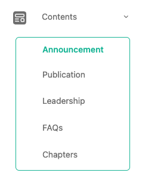
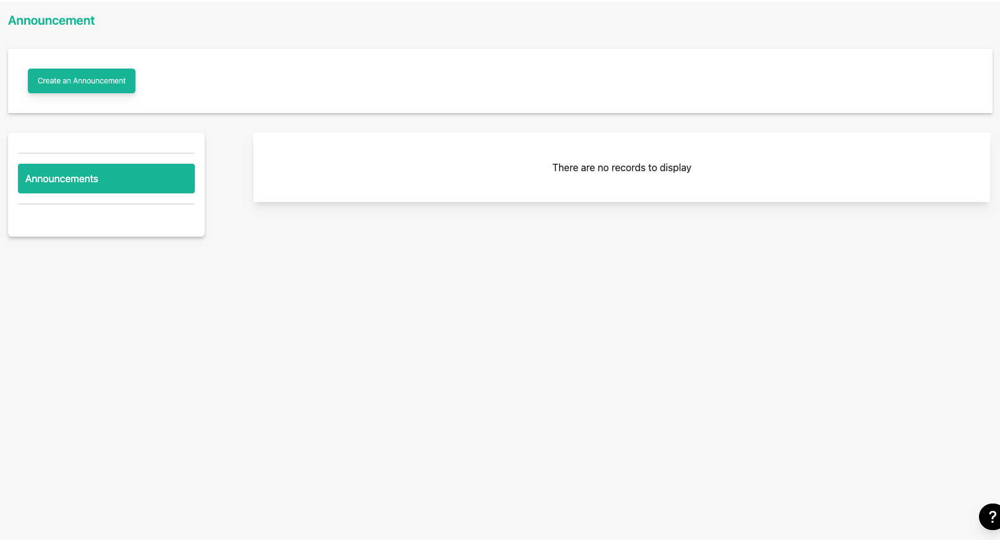
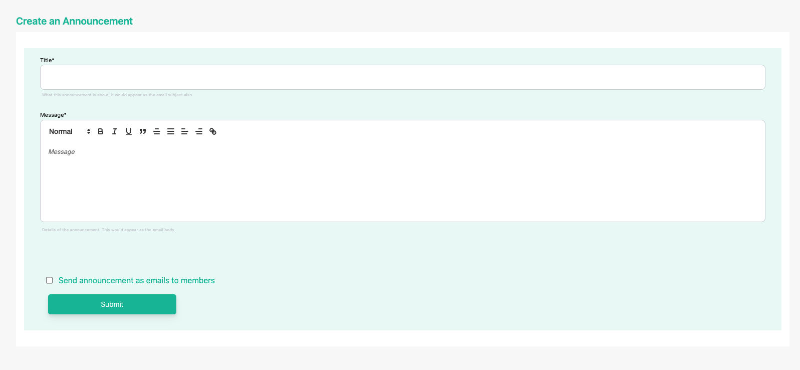
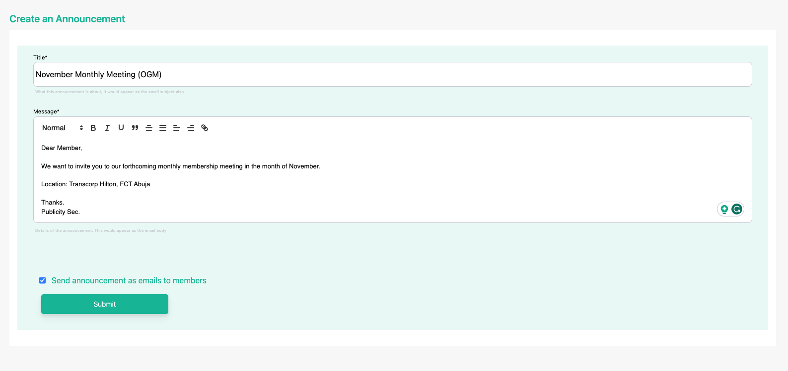
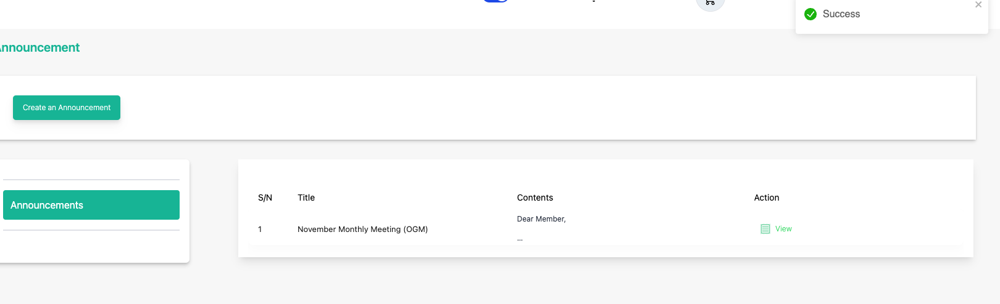
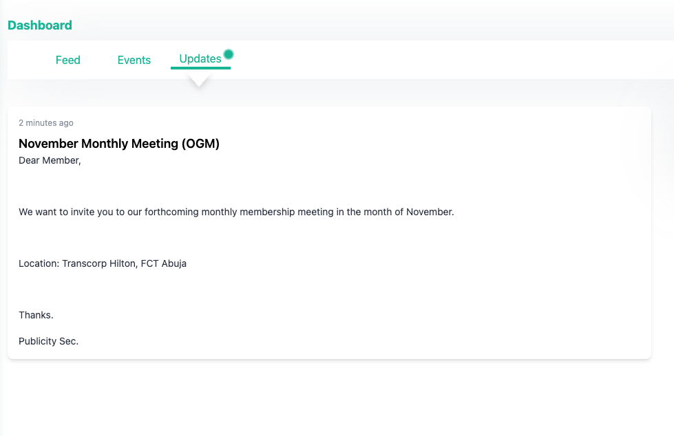

# Create an Announcement

**Topic:** How to create/make an announcement:

**Actor:** Content Admin/ Public Relations Officer/Super Admin:

The announcement feature on your website allows you to make public relations communications with members of your organization. The announcements you create are displayed on the website for all your members to see, and you can choose to send announcement notifications as emails to all members.

## How to create an announcement

1. Log in to your website as an admin and navigate to the admin dashboard.

2. On the navigation panel, identify the **Contents** menu item.

3. Click on the **Contents** menu item to reveal the sub-menu items.

    

4. Click on the **Announcements** sub-menu item to navigate to the announcements page.

    

    :::info

    This page displays the list of created announcements (if any) for your organization.
    :::

5. Click on the **Create Announcement** button to create a new announcement.

    

    On this page, you can input the announcement title and the message body that should be sent in the announcement. 

    There you can see an option to select Send announcement as emails to members, to send this announcement as emails to members.

    :::info
    Kindly review the contents of your announcement before you proceed with the action to send announcements as emails cannot be reversed. If you don’t select the option to send the announcement as an email, it will still be created and members can view it in their dashboard.
    :::

    

6. Click on the submit button to create the announcement

    

    You’ll get a success toast notification which indicates the announcement has been created.
	
    :::info
    You can view the announcement you just created by clicking on the **View** button. You can also edit or delete the announcement by clicking on the **Edit** or **Delete** button from the three veritical dots icon.
	:::

7. You’ve successfully finished creating the announcement.

    

    :::info
    Your members can see the announcement created on their dashboard home page, under the Updates section.
	:::

    :::tip

    **Congratulations!** You’ve created an announcement

    :::