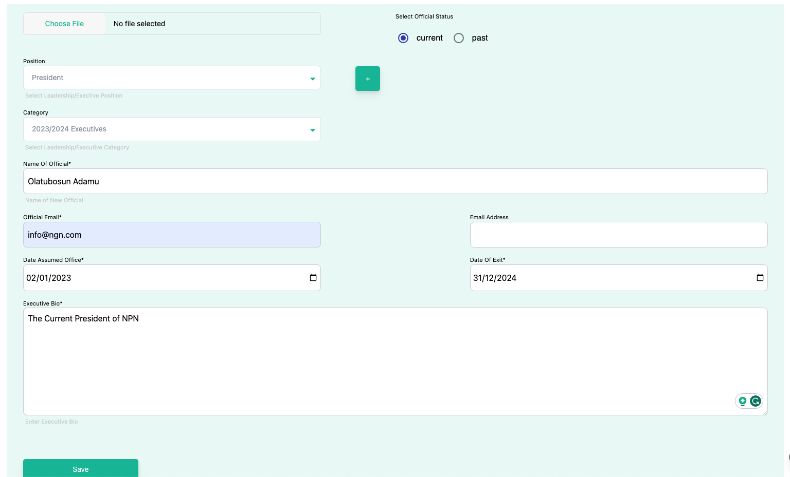
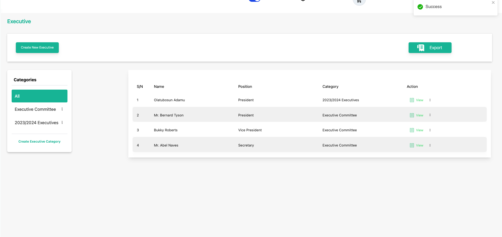

# Create an Executive

**Topic:** How to create a executive:

**Actor:** Content Admin/ Public Relations Officer/Super Admin:

This guide will take you through the steps to create a new executive using the Peddlesoft admin.

## How to create a executive

1. Log in to your website as an admin and navigate to the admin dashboard.

2. On the navigation panel, identify the **Contents** menu item.

3. Click on the **Contents** menu item to reveal the sub-menu items.

    

4. Click on the **Leadership** sub-menu item to navigate to the publications page.

    

    :::info

    Every executive must be under a category, therefore if the category of the executive you want to create is not available, you would need to create it. 

    :::

5. Create an **Executive**

    :::info

    If the executive category does not exist, then create it.

    :::

     
    
    ------------------------------------------------------------

    ### How to create an executive category

    a.  Click on the **Create Executive Category** button to create a new category.

    

    :::info

    A sidebar opens up for you to enter information.

    :::

    

    b. Enter the name of the executive category in the **Name** and **Description** fields.

    

    c. Click on the submit button to save.

    

    :::info

    You can see a new category has been created.
    
    :::

    d. Proceed to create a new executive.

    ------------------------------------------------------------

    ### Creating a new executive

    

    Provide the required information for each field.

    :::tip

    To select the image of the executive if available. Click on the Choose File button.

    :::

    

    :::tip

    A File chooser dialog will be opened for you to select the image. If it doesn’t you can initiate it by clicking the Click to select an image

    :::

    

    :::warning

    Max Image File Size 1MB

    :::

    You can choose to scale or resize the image using the dialog, it provides you a preview option to see what you are about to use as the image of the executive.

    

    After you’re satisfied, you can click finish to use the image preview or back to rescale or edit the image.

    

    Review the information entered for the executive.

    

6. Click save to finish creating an executive.

    :::info

    Wait for the information and image to be uploaded and saved.

    :::

    

    :::tip

    You’ll get a success notification to tell you that the publication has been uploaded. And you can see it in the outside pages of your website.

    :::

7. You can confirm the file has been uploaded on your website publication’s page.

    

    :::tip

    **Congratulations!** You’ve created an executive

    :::