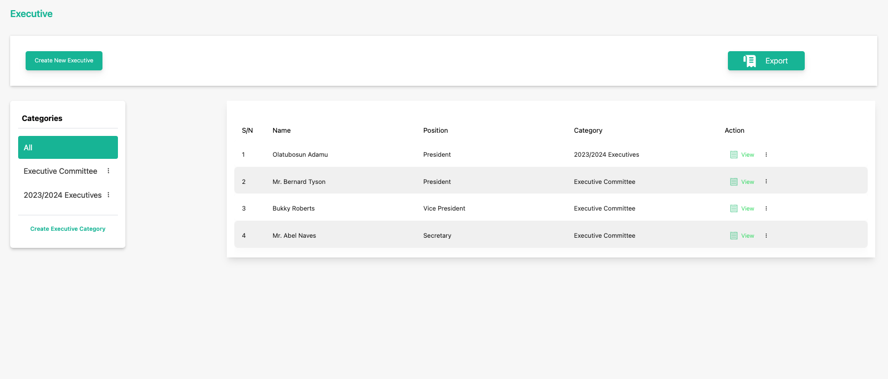

# Delete a Publication

**Topic:** How to delete a publication:

**Actor:** Content Admin/ Public Relations Officer/Super Admin:

Sometimes, you may need to remove outdated or irrelevant information about executives from your organization's website. This guide will take you through the steps to delete an executive using the Peddlesoft admin.

## How to delete a publication

1. Log in to your website as an admin and navigate to the admin dashboard.

2. On the navigation panel, identify the **Contents** menu item.

3. Click on the **Contents** menu item to reveal the sub-menu items.

    

4. Locate the **executive** you want to delete

    

5. Click on the three vertical dots icon to select and click the **Delete** option. 

    

6. You will be asked to confirm your action.

    

    :::info

    Click the **Yes, Delete it** button to confirm your action to delete the selected executive.

    :::

    :::tip

    **Congratulations!** You’ve deleted an executive.

    :::