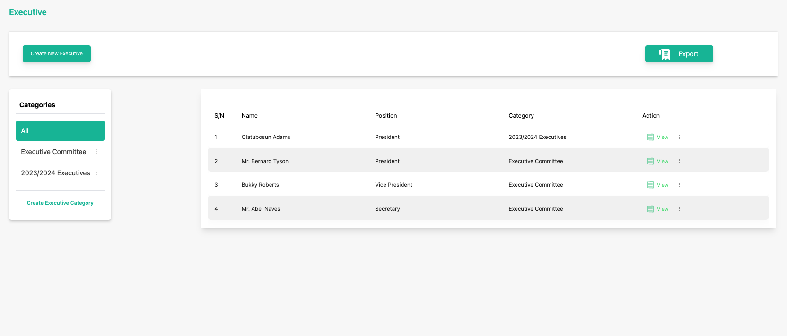
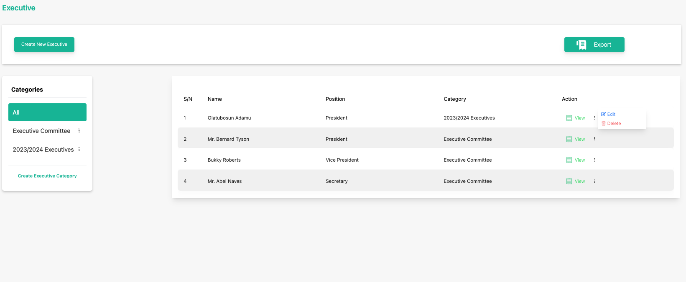
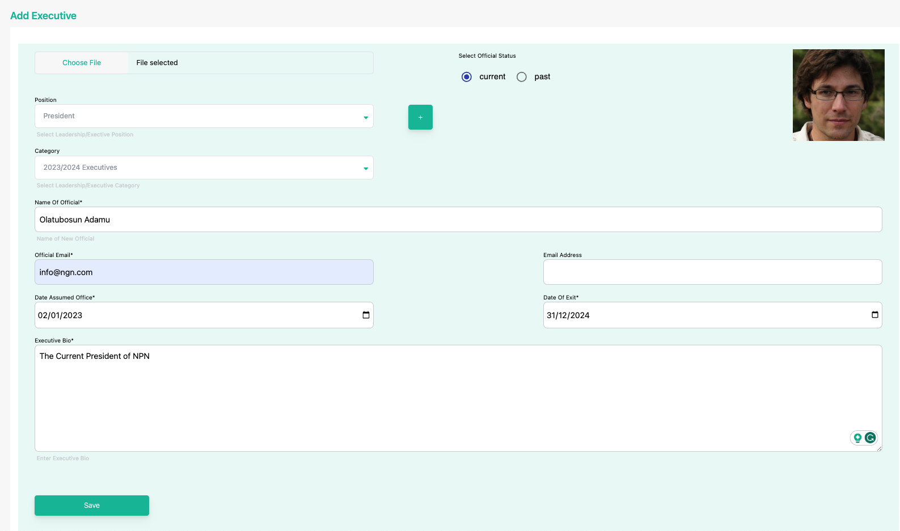
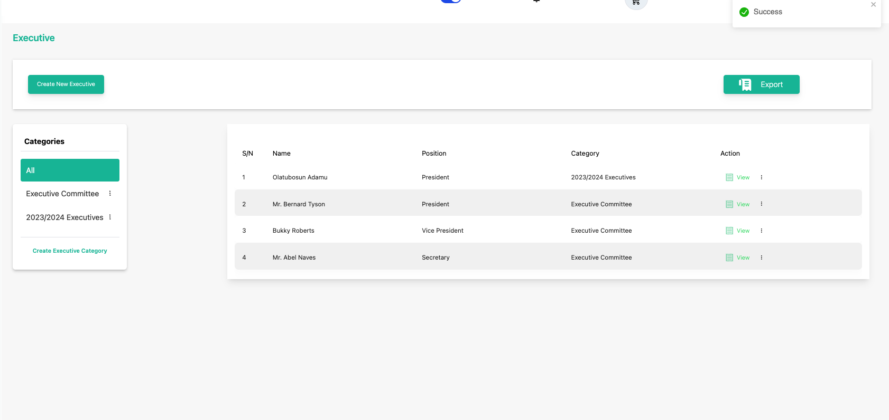

# Update a Publication

**Topic:** How to update a publication:

**Actor:** Content Admin/ Public Relations Officer/Super Admin:

Keeping your executive information up-to-date is essential to ensure that your organization's members receive the latest information. This guide will walk you through the steps to update an existing executive using the admin.

## How to update a publication

1. Log in to your website as an admin and navigate to the admin dashboard.

2. On the navigation panel, identify the **Contents** menu item.

3. Click on the **Contents** menu item to reveal the sub-menu items.

    

4. Locate the **executive** you want to edit

    

5. Click on the three vertical dots icon to select and click the **Edit** option. 

    

6. Edit the Executive

    :::info

    In the executive details, you can edit various segments of the executive.

    :::

    

    :::tip

    Update the executive’s Name, Position, or any other relevant information that needs modification.

    :::

7. Click save to finish updating the executive's information.

    

    :::tip

    **Congratulations!** You’ve updated the executive's information

    :::