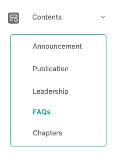
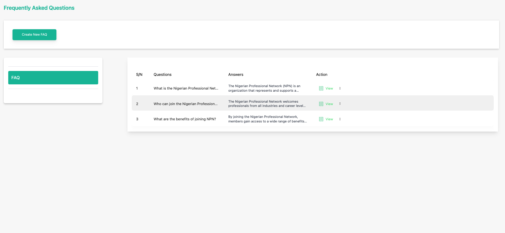
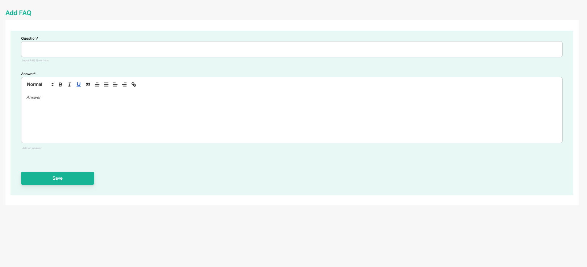
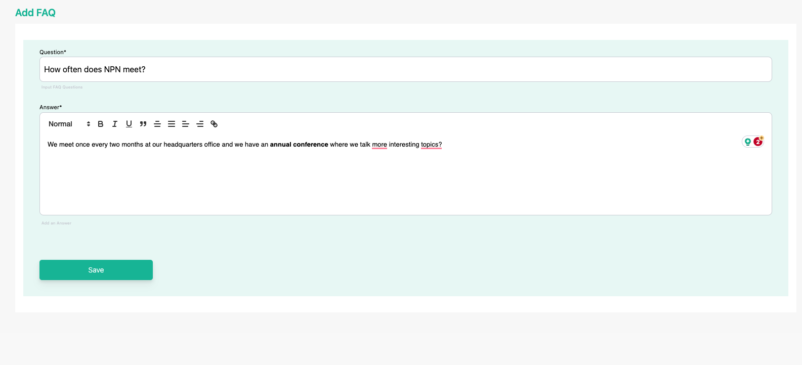
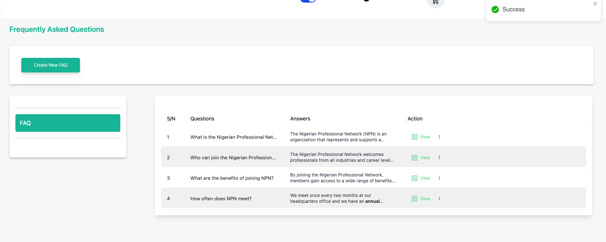
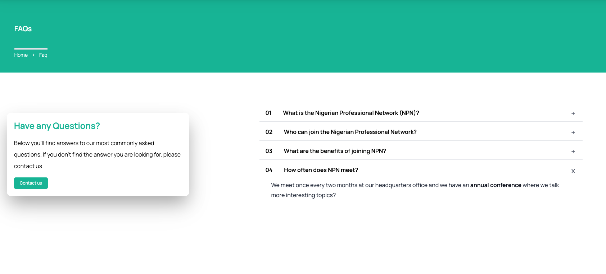

# Create an FAQ

**Topic:** How to create an FAQ:

**Actor:** Content Admin/ Public Relations Officer/Super Admin:

This guide will take you through the steps to create a new FAQ using the Peddlesoft admin.

## How to create an FAQ

1. Log in to your website as an admin and navigate to the admin dashboard.

2. On the navigation panel, identify the **Contents** menu item.

3. Click on the **Contents** menu item to reveal the sub-menu items.

    

4. Click on the **FAQs** sub-menu item to navigate to the FAQs page.

    

    :::info

    This page displays the list of created FAQs (if any) for your organization.
    :::

5. Click on the **Create New FAQ** button to open the page to create an FAQ.

    

    On this page, you can input the FAQ question and the response/answer.

    

6. Click on the save button to create the FAQ entry

    

    You’ll get a success toast notification which indicates the announcement has been created.
	
    :::info
    You’ve successfully created an FAQ entry.
	:::

7. Review created FAQs on your website page

    

    :::tip

    **Congratulations!** you’ve created an FAQ.

    :::