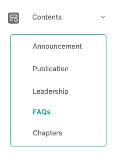
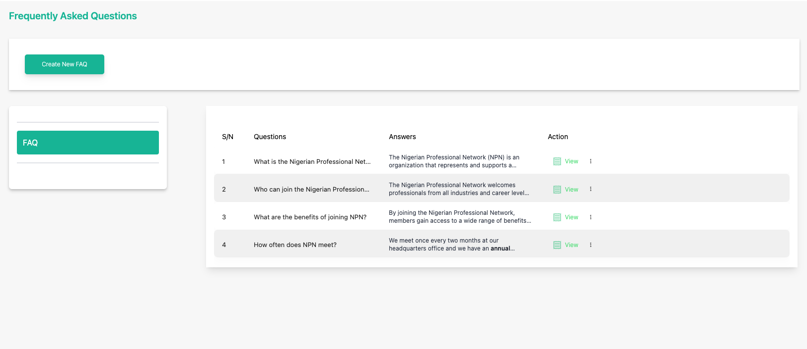
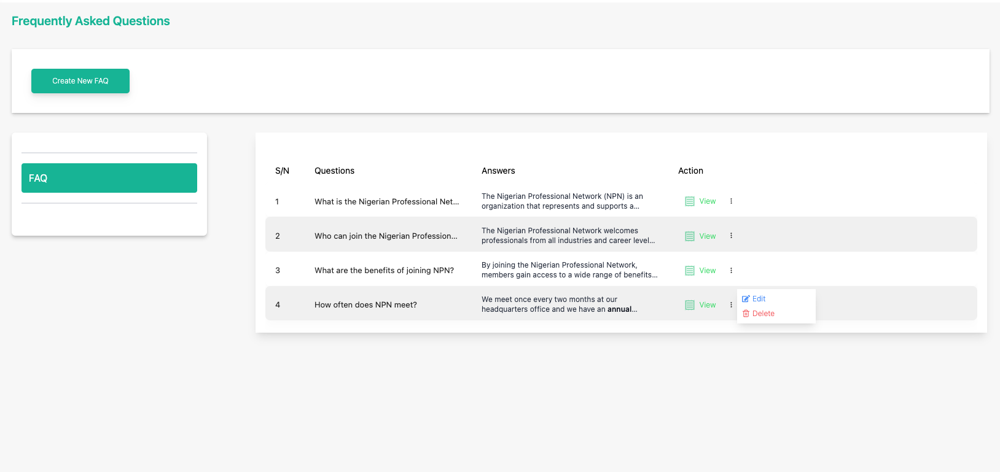
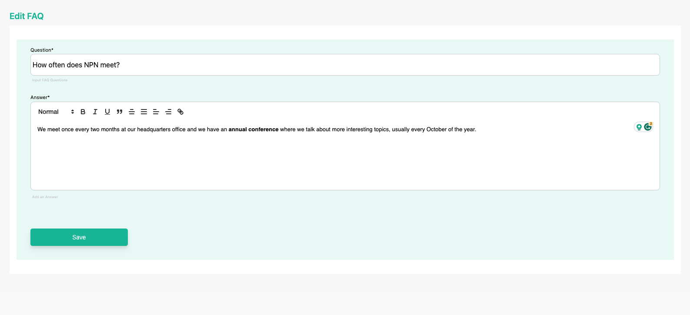
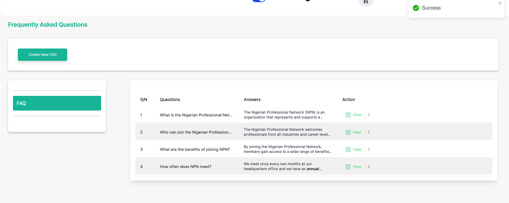

# Update a Publication

**Topic:** How to update an FAQ:

**Actor:** Content Admin/ Public Relations Officer/Super Admin:

Keeping your FAQ information up-to-date is essential to ensure that your organization's members receive the latest information. This guide will walk you through the steps to update an existing FAQ information using the admin.

## How to update an FAQ

1. Log in to your website as an admin and navigate to the admin dashboard.

2. On the navigation panel, identify the **Contents** menu item.

3. Click on the **Contents** menu item to reveal the sub-menu items.

    

4. Locate the **FAQ** you want to edit

    

5. Click on the three vertical dots icon to select and click the **Edit** option. 

    

6. Edit the FAQ

    :::info

    In the FAQ details page, you can edit the information of the FAQ.

    :::

    

    :::tip

    Update the information that needs modification.

    :::

7. Click Save to finish updating the FAQ information..

    

    :::tip

    **Congratulations!** You’ve updated the FAQ

    :::