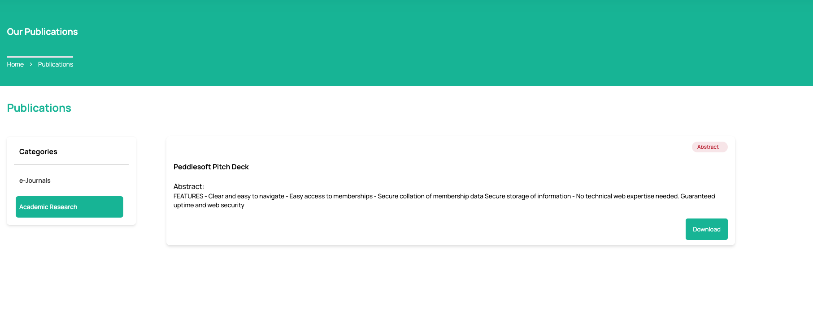

# Create a Publication

**Topic:** How to create a publication:

**Actor:** Content Admin/ Public Relations Officer/Super Admin:

The publication feature in your Peddlesoft admin application enables you to create and share content with your organization's members. Publications can include news articles, newsletters, and other important information. This guide will walk you through the steps to create a publication and share it with your members.

## How to create a publication

1. Log in to your website as an admin and navigate to the admin dashboard.

2. On the navigation panel, identify the **Contents** menu item.

3. Click on the **Contents** menu item to reveal the sub-menu items.

    

4. Click on the **Publication** sub-menu item to navigate to the publications page.

    

    :::info

    Every publication must be under a category, therefore if the category of the publication you want to create is not available, you would need to create it.

    :::

5. Create a **Publication**

    :::info

    If the publication category does not exist, then create it.

    :::

     
    
    ------------------------------------------------------------

    ### How to create a publication category

    a.  Click on the **Create Publication Category** button to create a publication.

    

    :::info

    A sidebar opens up for you to enter information.

    :::

    

    b. Enter the name of the publication category in the **Name** and **Description** fields.

    

    c. Click on the submit button to save.

    

    :::info

    You can see a new category has been created
    
    :::

    d. Proceed to create a new publication. 

    ------------------------------------------------------------

    ### Creating a new publication

    

    Provide the required information for each field.

    :::info

    You can provide two sources of information for the publication file. You can upload the publication file directly, or if the file size is more than the accepted file size, then you should upload the file to a third-party file storage platform like Google Drive, Dropbox, etc, and then get a sharable link; ensure that the permission for file access through the link allows anyone with the link. This is important!

    :::

    :::warning

    If you choose to upload a file directly to the website, only PDFs are accepted. Max File Size 5MB.

    :::

    

6. Click save to finish creating a publication.

    :::info

    Wait for the file to be uploaded if you choose the upload option.

    :::

    

    :::tip

    You’ll get a success notification to tell you that the publication has been uploaded. And you can see it in the outside pages of your website.

    :::

7. See list of already created publications.

    :::info

    You can edit or delete the publication by clicking on the **Edit** or **Delete** button from the three veritical dots icon.

    :::

    

8.  You can confirm the file has been uploaded on your website publication’s page.

    

    :::tip

    **Congratulations!** You’ve created a publication

    :::