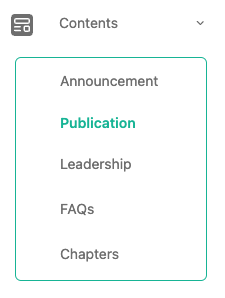
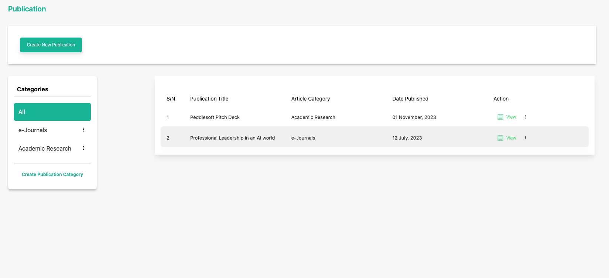
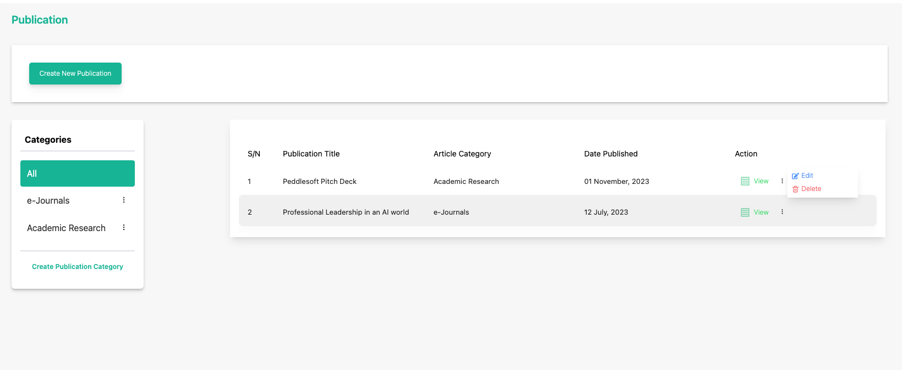
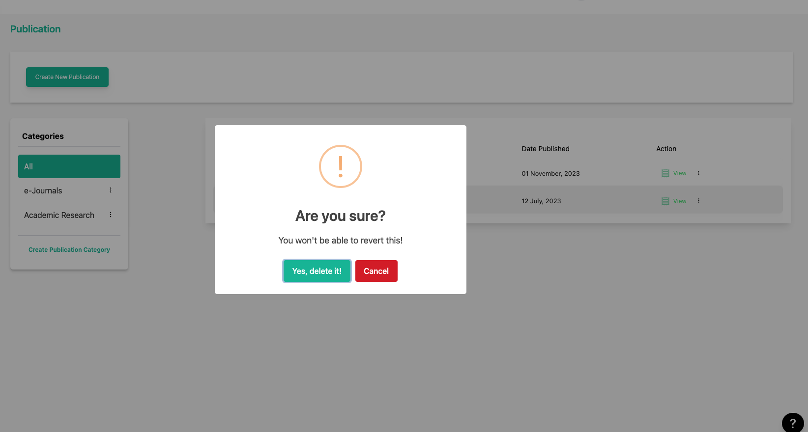

# Delete a Publication

**Topic:** How to delete a publication:

**Actor:** Content Admin/ Public Relations Officer/Super Admin:

Sometimes, you may need to remove outdated or irrelevant publications from your organization's website. This guide will take you through the steps to delete a publication using the Peddlesoft admin application.

## How to delete a publication

1. Log in to your website as an admin and navigate to the admin dashboard.

2. On the navigation panel, identify the **Contents** menu item.

3. Click on the **Contents** menu item to reveal the sub-menu items.

    

4. Locate the **publication** you want to delete

    

5. Click on the three vertical dots icon to select and click the **Delete** option. 

    

6. You will be asked to confirm your action.

    

    :::info

    Click the **Yes, Delete it** button to confirm your action to delete the selected publication.

    :::

    :::tip

    **Congratulations!** You’ve updated a publication

    :::