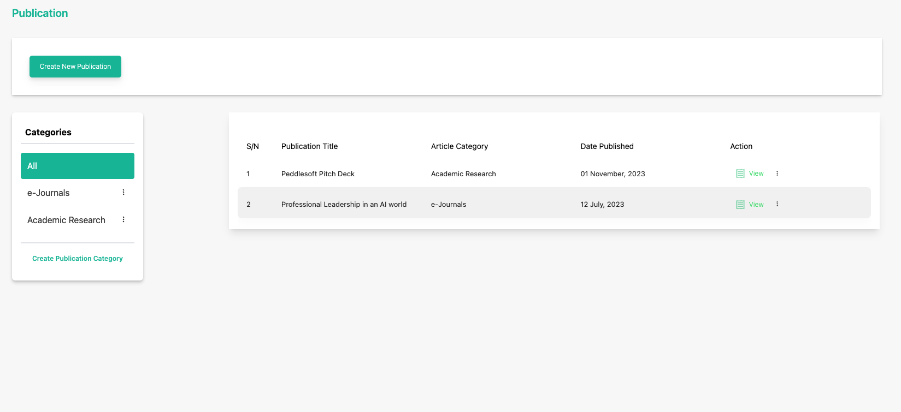

# Update a Publication

**Topic:** How to update a publication:

**Actor:** Content Admin/ Public Relations Officer/Super Admin:

Keeping your publications up-to-date is essential to ensure that your organization's members receive the latest information. This guide will walk you through the steps to update an existing publication using the Peddlesoft admin application.

## How to update a publication

1. Log in to your website as an admin and navigate to the admin dashboard.

2. On the navigation panel, identify the **Contents** menu item.

3. Click on the **Contents** menu item to reveal the sub-menu items.

    

4. Locate the **publication** you want to edit

    

5. Click on the three vertical dots icon to select and click the **Edit** option. 

    

6. Edit the Publication - In the publication details, you can edit various aspects of the publication.

    :::info

    Update the publication title, content, publication date, or any other relevant information that needs modification.

    :::

    

    :::tip

    You can view the file attached to the publication by clicking on the view file button

    :::

7. Click save to finish updating the publication.

    

    :::tip

    **Congratulations!** You’ve updated a publication

    :::